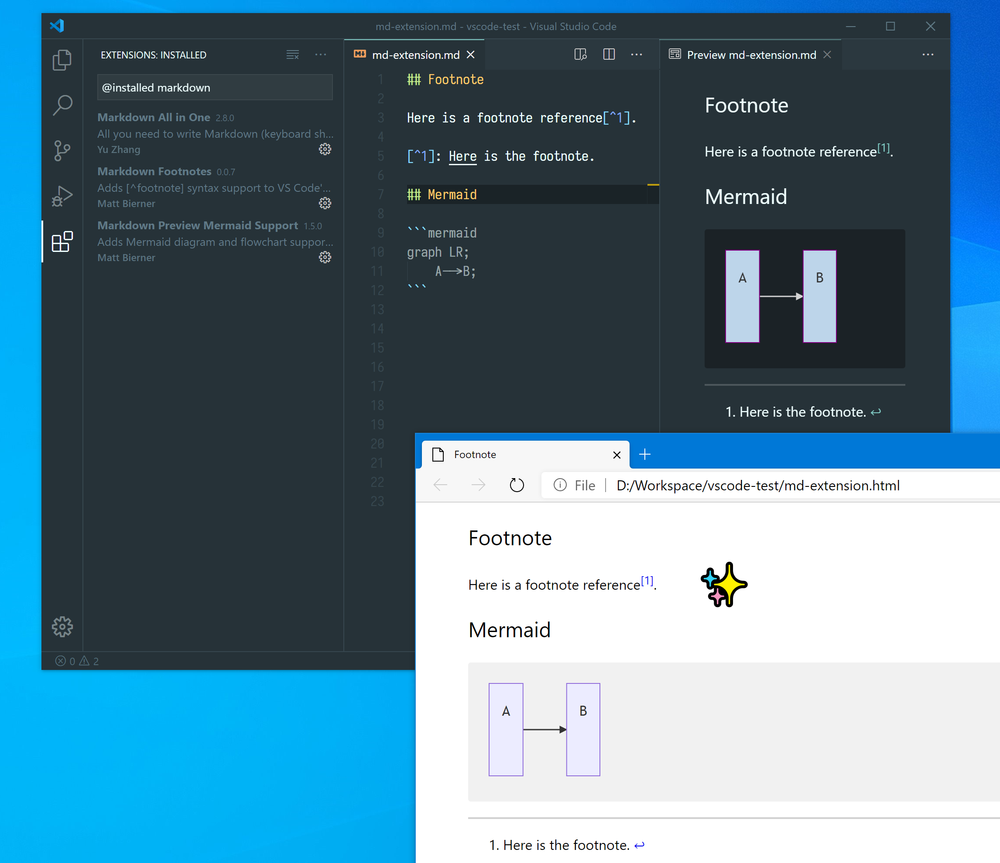
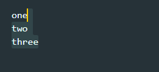
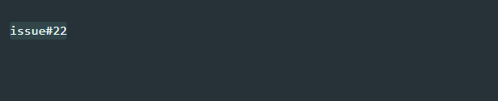
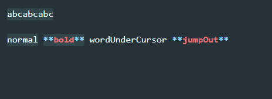
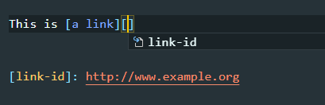
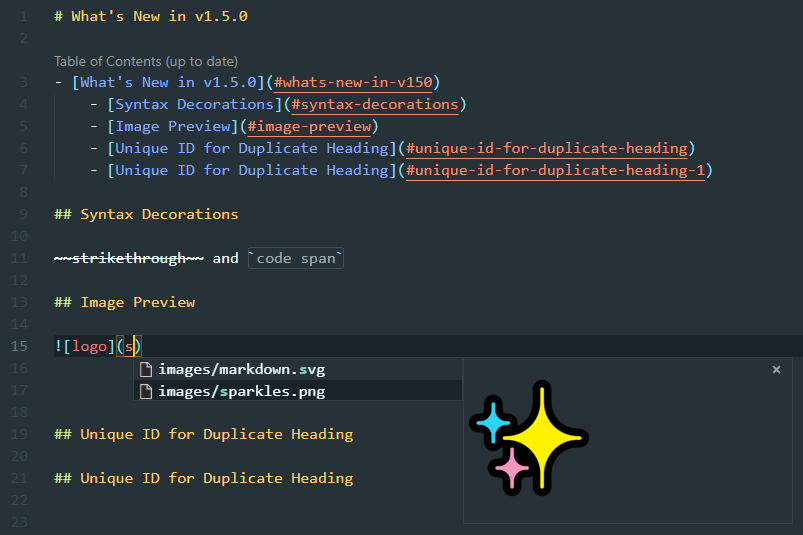
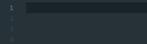

## 3.5.1 (2023.03.26)

### Fixes

- Quarto support, [#618](https://github.com/yzhang-gh/vscode-markdown/issues/618) follow-up ([#1199](https://github.com/yzhang-gh/vscode-markdown/pull/1199)). Thanks, [Dongdong Kong (@kongdd)](https://github.com/kongdd).
- [List renumbering] Incorrect second-level list renumbering on line delete ([#1155](https://github.com/yzhang-gh/vscode-markdown/issues/1155)).
- [Toggle list] A bug in multi-line case ([#1203](https://github.com/yzhang-gh/vscode-markdown/issues/1203)).
- [HTML] A bug that generates duplicated heading ids ([#1232](https://github.com/yzhang-gh/vscode-markdown/issues/1232)).

### Others

- Add Russian translations ([#1201](https://github.com/yzhang-gh/vscode-markdown/pull/1201)). Thanks, [Sergey Romanov (@Serhioromano)](https://github.com/Serhioromano).
- Fix the Shields build status badge ([#1215](https://github.com/yzhang-gh/vscode-markdown/pull/1215)). Thanks, [James H (@hughesjs)](https://github.com/hughesjs).
- Remove extra spaces when pasting links on selected text ([#1245](https://github.com/yzhang-gh/vscode-markdown/pull/1245)). Thanks, [auh (@fanlushuai)](https://github.com/fanlushuai).
- [Math] KaTeX v0.16.4
- [Completion] Disable path completions as VS Code now has built-in support.
- [Completion] Always exclude `.git` from completions.

## 3.5.0 (2022.11.20)

### New

- [TOC] Use `<!-- omit from toc -->` to omit a certain section from the table of contents. `<!-- omit in toc -->` is still supported for backward compatibility ([#1118](https://github.com/yzhang-gh/vscode-markdown/issues/1118)).
- [List continuation] The continuation of task list should now has the same behavior as other editors ([#1138](https://github.com/yzhang-gh/vscode-markdown/pull/1138)). Thanks, [@yy0931](https://github.com/yy0931).
- [List] New option `list.toggle.candidate-markers` to custom list markers when you use command `Toggle list` ([#1145](https://github.com/yzhang-gh/vscode-markdown/pull/1145)). Thanks, [@petergithub](https://github.com/petergithub).
- Add a new option `bold.indicator` so you can use either `**` or `__` for bold text ([#1174](https://github.com/yzhang-gh/vscode-markdown/pull/1174)). Thanks, [@krsche](https://github.com/krsche) and [Samuel Weinhardt (@samuel-weinhardt)](https://github.com/samuel-weinhardt).
- [R Markdown] Add support for R Markdown and a new option `extraLangIds` which accepts only `rmd` ~~and `qmd`~~ for now. ([#618](https://github.com/yzhang-gh/vscode-markdown/issues/618)). Thank [Dongdong Kong (@kongdd)](https://github.com/kongdd) for [#1198](https://github.com/yzhang-gh/vscode-markdown/pull/1198).
- [GFM task lists] Checkboxes are now visually enabled but but not clickable ([#1189](https://github.com/yzhang-gh/vscode-markdown/pull/1189)). Thanks, [Ian Holst (@ianholst)](https://github.com/ianholst).

### Fixes

- Update word pattern for code spans and strikethrough ([#1130](https://github.com/yzhang-gh/vscode-markdown/pull/1130)). Thanks, [@Yarakashi-Kikohshi](https://github.com/Yarakashi-Kikohshi).
- [Syntax decorations] of code spans ([#1134](https://github.com/yzhang-gh/vscode-markdown/pull/1134), [#1135](https://github.com/yzhang-gh/vscode-markdown/pull/1135)). Thanks, [@yy0931](https://github.com/yy0931).
- [Ordered list renumbering] An issue with sub-list ([#1155](https://github.com/yzhang-gh/vscode-markdown/issues/1155)).
- [HTML] Remove `<!-- omit from toc -->` comment in the title of the exported HTML ([#1175](https://github.com/yzhang-gh/vscode-markdown/issues/1175)).

### Others

- Code refactoring ([#1119](https://github.com/yzhang-gh/vscode-markdown/pull/1119)). Thanks, [@Lemmingh](https://github.com/Lemmingh).
- [Math] Update math function completions.
- Add custom context key for `onTabKey/onShiftTabKey` key binding. There should be less key binding conflicts in the future ([#1075](https://github.com/yzhang-gh/vscode-markdown/pull/1075)). Thanks, [@takumisoft68](https://github.com/takumisoft68).
- Better blockquote continuation ([#1183](https://github.com/yzhang-gh/vscode-markdown/issues/1183)).
- Reduce extension size by removing unused images ([#1161](https://github.com/yzhang-gh/vscode-markdown/issues/1161)). Thanks, [Kid (@kidonng)](https://github.com/kidonng).

## 3.4.3 (2022.4.24)

### Fixes

- [Math] mhchem support ([#1116](https://github.com/yzhang-gh/vscode-markdown/issues/1116)).
- VS Code freezes because of the new word pattern ([#1117](https://github.com/yzhang-gh/vscode-markdown/issues/1117)).

## 3.4.1 (2022.4.17)

**Update 3.4.2**: fix dependencies.

### Breaking Changes

- [Table formatter] Now you need to escape the pipe character (`|`) inside table cells, even if it is in a code span. This behavior follows the [GFM spec](https://github.github.com/gfm/#example-200). ([#24](https://github.com/yzhang-gh/vscode-markdown/issues/24))

### New

- [Auto completion] Add `.webp` files to the image path suggestions ([#934](https://github.com/yzhang-gh/vscode-markdown/issues/934)).

### Fixes

- Resolve <kbd>Tab</kbd> conflict when `inlineSuggestionVisible`, e.g., GitHub Copilot ([#665](https://github.com/yzhang-gh/vscode-markdown/issues/665), [#1011](https://github.com/yzhang-gh/vscode-markdown/issues/1011)).
- Multi-cursor list editing ([#829](https://github.com/yzhang-gh/vscode-markdown/issues/829), [#926](https://github.com/yzhang-gh/vscode-markdown/issues/926)).
- You can now add section numbers larger than 99 ([#852](https://github.com/yzhang-gh/vscode-markdown/issues/852)).
- Resolve keybinding conflict <kbd>Alt</kbd> + <kbd>Shift</kbd> + <kbd>Up/Down</kbd> on Linux ([#857](https://github.com/yzhang-gh/vscode-markdown/issues/857)).
- TOC with a heading ending with literal `#` ([#867](https://github.com/yzhang-gh/vscode-markdown/issues/867)).
- Load extension-contributed scripts asynchronously ([#956](https://github.com/yzhang-gh/vscode-markdown/pull/956)). Thanks, [Jay Park (@phoihos)](https://github.com/phoihos).
- The internal command `_wrapBy` ignores the `after` argument ([#1051](https://github.com/yzhang-gh/vscode-markdown/pull/1051)). Thanks, [@King-of-Infinite-Space](https://github.com/King-of-Infinite-Space).
- Set `vscode-dark` class when exporting to HTML with dark theme ([#1091](https://github.com/yzhang-gh/vscode-markdown/pull/1091)). Thanks, [Raphael Sander (@raphaelsander)](https://github.com/raphaelsander).

### Others

- Code health ([#869](https://github.com/yzhang-gh/vscode-markdown/pull/869)). Thanks to [@Lemmingh](https://github.com/Lemmingh).
- (Temporary fix) The `toggleMath` issue with blockquotes ([#907](https://github.com/yzhang-gh/vscode-markdown/issues/907)).
- Update Japanese translations ([#909](https://github.com/yzhang-gh/vscode-markdown/pull/909)). Thanks, [にせ十字 (@falsecross)](https://github.com/falsecross).
- [Math] Upgrade KaTeX ([#943](https://github.com/yzhang-gh/vscode-markdown/issues/943)).
- The `togglePreview` command has been replaced by `closePreview` ([`05fb1af`](https://github.com/yzhang-gh/vscode-markdown/commit/05fb1af27150fa8c1c271fc03533d28787ea25d1)).
- Enable virtual workspaces support (limited functionality) ([#948](https://github.com/yzhang-gh/vscode-markdown/pull/948), [#996](https://github.com/yzhang-gh/vscode-markdown/pull/996))
- Update Markdown word pattern ([#1092](https://github.com/yzhang-gh/vscode-markdown/issues/1092)).
- A few documentation improvements.

---

### 3.4.0 (2020.11.14)

- **New**: New TOC slugify mode `azureDevops` ([#802](https://github.com/yzhang-gh/vscode-markdown/issues/802)).

<!--  -->

- **Fix**: Math syntax highlight ([#346](https://github.com/yzhang-gh/vscode-markdown/issues/346)).
- **Fix**: Color of the inline code span outline (now using `editor.selectionBackground`) ([#734](https://github.com/yzhang-gh/vscode-markdown/issues/734)).
- **Fix**: Broken TOC links if headings have emoji ([#792](https://github.com/yzhang-gh/vscode-markdown/issues/792)).
- **Fix**: Catch exception of other Markdown extensions ([#834](https://github.com/yzhang-gh/vscode-markdown/issues/834)).
- **Fix**: Compatibility with [Markdown Preview Github Styling](https://marketplace.visualstudio.com/items?itemName=bierner.markdown-preview-github-styles).

<!--  -->

- **Other**: Many documentation improvements.
- **Other**: Automatically build `debug.vsix` using GitHub Actions ([#837](https://github.com/yzhang-gh/vscode-markdown/pull/837)).

---

### 3.3.0 (2020.08.31)

- **New**: You can now use `<!-- title: Your Title Here -->` comment to specify a title of the exported HTML ([#506](https://github.com/yzhang-gh/vscode-markdown/issues/506)).
- **New**: Added a `toc.slugifyMode` option `gitea` ([#763](https://github.com/yzhang-gh/vscode-markdown/pull/763)). Thanks, [Rodolphe Houdas (@rodolpheh)](https://github.com/rodolpheh).
- **New**: Option `completion.respectVscodeSearchExclude` controlling where to look for file path completions ([#789](https://github.com/yzhang-gh/vscode-markdown/issues/789)).

<!--  -->

- **Fix**: Failure of `toggleList` command if there are more than 9 list items ([#776](https://github.com/yzhang-gh/vscode-markdown/issues/776)).
- **Fix**: Command `togglePreviewToSide` wouldn't close the preview tab ([#780](https://github.com/yzhang-gh/vscode-markdown/pull/780)). Thanks, [Anton Tuchkov (@Technik-J)](https://github.com/Technik-J).
- **Fix**: `- - -` was wrongly treated as a list item ([#785](https://github.com/yzhang-gh/vscode-markdown/issues/785)).

<!--  -->

- **Other**: Activate extension on command `printToHtmlBatch` ([#769](https://github.com/yzhang-gh/vscode-markdown/issues/769)).

---

### 3.2.0 (2020.07.25)

- **New**: [Batch export] command "print document**s** to HTML" ([#594](https://github.com/yzhang-gh/vscode-markdown/issues/594), [#747](https://github.com/yzhang-gh/vscode-markdown/issues/747)).

<!--  -->

- **Fix**: [HTML export] escape spaces in image path ([#731](https://github.com/yzhang-gh/vscode-markdown/issues/731)).
- **Fix**: [TOC] headings with LaTeX ([#732](https://github.com/yzhang-gh/vscode-markdown/issues/732)).

<!--  -->

- **Other**: A lot of `README` improvements.

---

### 3.1.0 (2020.06.20)

- **New**: Option `print.includeVscodeStylesheets` ([#726](https://github.com/yzhang-gh/vscode-markdown/pull/726)). Thanks, [Gluck_S (@Glucksistemi)](https://github.com/Glucksistemi).
- **New**: Option `syntax.decorationFileSizeLimit` ([#728](https://github.com/yzhang-gh/vscode-markdown/pull/728)). Thanks, [Rohit Patnaik (@quanticle)](https://github.com/quanticle).

<!--  -->

- **Fix**: Wrong mime type of SVG in exported HTML ([#694](https://github.com/yzhang-gh/vscode-markdown/issues/694)).
- **Fix**: Heading numbering issues ([#695](https://github.com/yzhang-gh/vscode-markdown/issues/695), [#701](https://github.com/yzhang-gh/vscode-markdown/issues/701)).
- **Fix**: TOC issues ([#555](https://github.com/yzhang-gh/vscode-markdown/issues/555), [#699](https://github.com/yzhang-gh/vscode-markdown/issues/699), [#706](https://github.com/yzhang-gh/vscode-markdown/issues/706))
- **Fix**: Counterintuitive behavior of command `checkTaskList` ([#700](https://github.com/yzhang-gh/vscode-markdown/issues/700)).

<!--  -->

- **Other**: `README` improvements ([#709](https://github.com/yzhang-gh/vscode-markdown/pull/709)). Thanks, [Quang Vu (@vhquang)](https://github.com/vhquang).

---

### 3.0.0 (2020.05.24)

#### Highlights

- **Breaking change**: Replace `toc.githubCompatibility` with `toc.slugifyMode`. Now GitLab-style TOC is supported ([#660](https://github.com/yzhang-gh/vscode-markdown/pull/660)). Thanks, [@BeeeWall](https://github.com/BeeeWall).

<!--  -->

- **New**: Command to add/update/remove numbering to headings ([#457](https://github.com/yzhang-gh/vscode-markdown/issues/457), [#555](https://github.com/yzhang-gh/vscode-markdown/issues/555)).
- **New**: Automatically include other installed Markdown plugins when exporting Markdown to HTML ([#658](https://github.com/yzhang-gh/vscode-markdown/pull/658)). Thanks, [qiqiworld (@1354092549)](https://github.com/1354092549).
- **New**: The links to `.md` files will be renamed to `.html` in the exported HTML ([#667](https://github.com/yzhang-gh/vscode-markdown/issues/667)).

<!--  -->

- **Fix**: Properly handle Markdown syntax in TOC entries ([#654](https://github.com/yzhang-gh/vscode-markdown/pull/654)).
- **Fix**: An issue with `workspaceFolders` ([#666](https://github.com/yzhang-gh/vscode-markdown/issues/666)).
- **Fix**: Slugify function `github` should downcase also non-Latin characters ([#670](https://github.com/yzhang-gh/vscode-markdown/pull/670)). Thanks, [lesha (@lesha-co)](https://github.com/lesha-co).
- **Fix**: TOC issues ([#675](https://github.com/yzhang-gh/vscode-markdown/issues/675), [#683](https://github.com/yzhang-gh/vscode-markdown/issues/683)).
- **Fix**: Table formatter fails if there are two identical tables ([#682](https://github.com/yzhang-gh/vscode-markdown/issues/682)).
- **Fix**: CJ**K** characters in Markdown Tables ([#685](https://github.com/yzhang-gh/vscode-markdown/issues/685)).

<!--  -->

- **Other**: Expose `wrapBy` function ([#663](https://github.com/yzhang-gh/vscode-markdown/issues/663)).
- **Other**: `README` improvements ([#681](https://github.com/yzhang-gh/vscode-markdown/pull/681)). Thanks, [Kaspar (@casaper)](https://github.com/casaper).

---

### 2.8.0 (2020.04.10)

- **New**: Path auto-completion now respects option `search.exclude` ([#614](https://github.com/yzhang-gh/vscode-markdown/issues/614)).
- **New**: Suggest `katex.macros` in math environments ([#633](https://github.com/yzhang-gh/vscode-markdown/pull/633)). Thanks, [Y. Ding (@yd278)](https://github.com/yd278).
- **New**: Option `math.enabled`.

<!--  -->

- **Fix**: Escape spaces in file path completions ([#590](https://github.com/yzhang-gh/vscode-markdown/pull/590)). Thanks, [Tomoki Aonuma (@uasi)](https://github.com/uasi).
- **Fix**: TOC issues ([#593](https://github.com/yzhang-gh/vscode-markdown/issues/593), [#603](https://github.com/yzhang-gh/vscode-markdown/issues/603), [#629](https://github.com/yzhang-gh/vscode-markdown/issues/629)).
- **Fix**: Table formatter for Thai characters ([#602](https://github.com/yzhang-gh/vscode-markdown/pull/602)). Thanks, [Nutchanon Ninyawee (@CircleOnCircles)](https://github.com/CircleOnCircles).
- **Fix**: Single column table formatting ([#604](https://github.com/yzhang-gh/vscode-markdown/pull/604)). Thanks, [@chnicholas](https://github.com/chnicholas).
- **Fix**: Issues with option `omitFromToc` ([#644](https://github.com/yzhang-gh/vscode-markdown/issues/644)).

<!--  -->

- **Other**: Added Japanese translation ([#608](https://github.com/yzhang-gh/vscode-markdown/pull/608)). Thanks, [にせ十字 (@falsecross)](https://github.com/falsecross).
- **Other**: Upgraded KaTeX.
- **Other**: Moved from AppVeyor to GitHub Actions. Thank [雪松 (@yxs)](https://github.com/yxs) for the CI badge.

---

### 2.7.0 (2020.01.11)

- **New**: Option `omittedFromToc` ([#580](https://github.com/yzhang-gh/vscode-markdown/pull/580)). Thanks, [Dorian Marchal (@dorian-marchal)](https://github.com/dorian-marchal).

<!--  -->

- **Fix**: Don't continue list item in math environment ([#574](https://github.com/yzhang-gh/vscode-markdown/issues/574)).
- **Fix**: HTML entities in TOC ([#575](https://github.com/yzhang-gh/vscode-markdown/issues/575)).
- **Fix**: User-defined KaTeX macros weren't included in the exported HTML ([#579](https://github.com/yzhang-gh/vscode-markdown/issues/579)).
- **Fix**: Strange HTML tags in the generated TOC ([#585](https://github.com/yzhang-gh/vscode-markdown/issues/585)).
- **Fix**: Use `%20` for space in URL ([#589](https://github.com/yzhang-gh/vscode-markdown/issues/589)).

<!--  -->

- **Other**: Update keybindings ([#571](https://github.com/yzhang-gh/vscode-markdown/issues/571)).
- **Other**: Disable decorations for large files (threshold 128 KB → 50 KB) ([#578](https://github.com/yzhang-gh/vscode-markdown/issues/578)).

---

### 2.6.1 (2019.12.12)

- **Fix**: Strange HTML tags in TOC ([#567](https://github.com/yzhang-gh/vscode-markdown/issues/567)).

---

### 2.6.0 (2019.12.08)

- **New**: Support `<!-- omit in toc -->` above a heading ([#495](https://github.com/yzhang-gh/vscode-markdown/issues/495)).
- **New**: Support `<!-- no toc -->` above a list ([#525](https://github.com/yzhang-gh/vscode-markdown/issues/525)).
- **New**: Option `print.theme` ([#534](https://github.com/yzhang-gh/vscode-markdown/issues/534)).
- **New**: Command "toggle code block" ([#551](https://github.com/yzhang-gh/vscode-markdown/pull/551)). Thanks, [@axiqia](https://github.com/axiqia).
- **New**: Support image path completions for HTML `img` tags.
- **New**: Include [Markdown Footnotes](https://marketplace.visualstudio.com/items?itemName=bierner.markdown-footnotes) in exported HTML if you have that extension installed ([#212](https://github.com/yzhang-gh/vscode-markdown/issues/212)).

<!--  -->

- **Fix**: TOC links ([#494](https://github.com/yzhang-gh/vscode-markdown/issues/494), [#515](https://github.com/yzhang-gh/vscode-markdown/issues/515) and [#550](https://github.com/yzhang-gh/vscode-markdown/issues/550)).
- **Fix**: No longer convert images paths with data URIs ([#539](https://github.com/yzhang-gh/vscode-markdown/pull/539)). Thanks, [@leapwill](https://github.com/leapwill).
- **Fix**: Unexpected ordered list marker updating ([#546](https://github.com/yzhang-gh/vscode-markdown/pull/546)). Thanks, [Alper Cugun (@alper)](https://github.com/alper).
- **Fix**: <kbd>Shift</kbd> + <kbd>Tab</kbd> never outdents ([#561](https://github.com/yzhang-gh/vscode-markdown/issues/561)).

<!--  -->

- **Other**: Update `README` with high-resolution images.

---

### 2.5.0/2.5.1 (2019.10.12)

- **New**: File path completions ([#497](https://github.com/yzhang-gh/vscode-markdown/pull/497)). Thanks, [@linsui](https://github.com/linsui).
- **New**: Toggle multiple checkboxes ([#513](https://github.com/yzhang-gh/vscode-markdown/pull/513)). Thanks, [@GeorchW](https://github.com/GeorchW).
- **New**: Option `print.validateUrls` ([#517](https://github.com/yzhang-gh/vscode-markdown/pull/517)). Thanks, [Olmo Maldonado (@ibolmo)](https://github.com/ibolmo).
- **New**: Add KaTeX mhchem extension ([#521](https://github.com/yzhang-gh/vscode-markdown/pull/521)). Thanks, [Balthild Ires (@balthild)](https://github.com/balthild).
- **New**: Option `completion.root` ([#526](https://github.com/yzhang-gh/vscode-markdown/issues/526)).

<!--  -->

- **Fix**: Cannot recognize indented headings ([#508](https://github.com/yzhang-gh/vscode-markdown/issues/508)).
- **Fix**: TOC and code blocks ([#532](https://github.com/yzhang-gh/vscode-markdown/issues/532)).

<!--  -->

- **Other**: New logo with white background ([#498](https://github.com/yzhang-gh/vscode-markdown/issues/498)).
- **Other**: Remove obsolete HTML attributes ([#499](https://github.com/yzhang-gh/vscode-markdown/issues/499)).
- **Other**: Use light theme in exported HTML ([#529](https://github.com/yzhang-gh/vscode-markdown/issues/529)).

---

### 2.4.1/2.4.2 (2019.07.21)

- **New**: Option `toc.downcaseLink` (default: `true`) ([#476](https://github.com/yzhang-gh/vscode-markdown/issues/476)).

<!--  -->

- **Fix**: KaTeX macros ([#473](https://github.com/yzhang-gh/vscode-markdown/pull/473)). Thanks, [Pierre (@PierreMarchand20)](https://github.com/PierreMarchand20).
- **Fix**: Ignore headings in comments ([#462](https://github.com/yzhang-gh/vscode-markdown/issues/462)).
- **Fix**: Magic comment `<!-- omit in toc -->` was ignored ([#490](https://github.com/yzhang-gh/vscode-markdown/issues/490)).

<!--  -->

- **Other**: Improve performance for large documents

---

### 2.4.0 (2019.06.16)

- **New**: Command `toggleList` (*Note: no default keybinding assigned*) ([#237](https://github.com/yzhang-gh/vscode-markdown/issues/237), [#307](https://github.com/yzhang-gh/vscode-markdown/issues/307)).

  

<!--  -->

- **New**: Support KaTeX macros ([#426](https://github.com/yzhang-gh/vscode-markdown/issues/426)). Thanks, [Pierre (@PierreMarchand20)](https://github.com/PierreMarchand20).

<!--  -->

- **Fix**: Image paths ([#415](https://github.com/yzhang-gh/vscode-markdown/issues/415)).
- **Fix**: Fenced code block checking ([#434](https://github.com/yzhang-gh/vscode-markdown/issues/434)).

<!--  -->

- **Other**: Don't downcase the TOC links ([#312](https://github.com/yzhang-gh/vscode-markdown/issues/312)). Thanks, [Scott Meesseman (@spmeesseman)](https://github.com/spmeesseman).
- **Other**: Command `toggleMath` now cycles through `|` -> `$|$` -> `$$\n|\n$$` -> `$$ | $$` ([#421](https://github.com/yzhang-gh/vscode-markdown/issues/421#issuecomment-493747064)). Thanks, [Li Yiming (@upupming)](https://github.com/upupming).
- **Other**: Don't include KaTeX stylesheets in the exported HTML if no math ([#430](https://github.com/yzhang-gh/vscode-markdown/issues/430)).
- **Other**: Upgrade KaTeX ([#446](https://github.com/yzhang-gh/vscode-markdown/issues/446)).
- **Other**: Better math completions ([PR#470](https://github.com/yzhang-gh/vscode-markdown/pull/470), [PR#471](https://github.com/yzhang-gh/vscode-markdown/pull/471)).

---

### 2.3.1 (2019.04.29)

- **Fix**: Option `markdown.extension.print.onFileSave` not respected ([#432](https://github.com/yzhang-gh/vscode-markdown/issues/432)).

---

### 2.3.0 (2019.04.28)

- **New** Prefer unused links for reference link label completions ([#414](https://github.com/yzhang-gh/vscode-markdown/issues/414)). Thanks, [Chris (@alshain)](https://github.com/alshain).
- **New**: Option `markdown.extension.print.onFileSave` ([#417](https://github.com/yzhang-gh/vscode-markdown/issues/417)). Thanks, [Li Yiming (@upupming)](https://github.com/upupming).
- **New**: Autocompletion for heading links ([#419](https://github.com/yzhang-gh/vscode-markdown/issues/419)). Thanks again, [Chris (@alshain)](https://github.com/alshain).

<!--  -->

- **Fix**: Syntax decorations ([#390](https://github.com/yzhang-gh/vscode-markdown/issues/390)).
- **Fix**: Table formatter ([#408](https://github.com/yzhang-gh/vscode-markdown/issues/408)).
- **Fix**: Delete space rather than outdent list when there are two or more spaces on <kbd>Backspace</kbd> ([#410](https://github.com/yzhang-gh/vscode-markdown/issues/410)).
- **Fix**: Image paths in exported HTML ([#415](https://github.com/yzhang-gh/vscode-markdown/issues/415), [#429](https://github.com/yzhang-gh/vscode-markdown/issues/429)).
- **Fix**: TOC and fenced code blocks ([#425](https://github.com/yzhang-gh/vscode-markdown/issues/425)).

<!--  -->

- **Other**: Sort KaTeX functions (lowercase first) ([#413](https://github.com/yzhang-gh/vscode-markdown/issues/413)).
- **Other**: Update KaTeX supported functions ([#416](https://github.com/yzhang-gh/vscode-markdown/issues/416)). Thanks again, [Li Yiming (@upupming)](https://github.com/upupming).

---

### 2.2.0 (2019.03.24)

- **Fix**: Better syntax decorations ([#390](https://github.com/yzhang-gh/vscode-markdown/issues/390), [#393](https://github.com/yzhang-gh/vscode-markdown/issues/393)).
- **Fix**: Recognize relative path of `markdown.styles` when exporting to HTML ([#394](https://github.com/yzhang-gh/vscode-markdown/issues/394)).
- **Other**: Unregister formatter when being disabled ([#395](https://github.com/yzhang-gh/vscode-markdown/issues/395)).
- **Other**: Better URL regexp ([#397](https://github.com/yzhang-gh/vscode-markdown/issues/397)). Thanks, [Igor (@Ovsyanka)](https://github.com/Ovsyanka).
- **Other**: Remove default `alt + s` keybinding for macOS ([#404](https://github.com/yzhang-gh/vscode-markdown/issues/404)).
- **Other**: webpack!

---

### 2.1.1 (2019.03.05)

- **Fix**: Table format ([#381](https://github.com/yzhang-gh/vscode-markdown/issues/381)).
- **Fix**: Unexpected link creation on pasting ([#382](https://github.com/yzhang-gh/vscode-markdown/issues/382)).
- **Fix**: Image path encoding when printing ([#385](https://github.com/yzhang-gh/vscode-markdown/issues/385)).

---

### 2.1.0 (2019.02.16)

- **New**: Paste link on selected text ([#20](https://github.com/yzhang-gh/vscode-markdown/issues/20)).

  

- **New**: Multi-cursor support ([#33](https://github.com/yzhang-gh/vscode-markdown/issues/33)).

  

- **New**: Auto-complete for reference link IDs ([#366](https://github.com/yzhang-gh/vscode-markdown/issues/366)).

  

<!--  -->

- **Fix**: Conflict with `editor.tabCompletion` setting ([#367](https://github.com/yzhang-gh/vscode-markdown/issues/367)).

<!--  -->

- **Other**: Added ways to buy me a coffee 😉 ([PayPal](https://www.paypal.me/2yzhang), [Alipay or WeChat](donate.md)).

---

### 2.0.0 (2019.01.19)

🎂🎂 This extension is 2 years old!

- **New**: Option `markdown.extension.list.indentationSize` ([#344](https://github.com/yzhang-gh/vscode-markdown/issues/344)).
  - `adaptive`: use 2 spaces indentation for unordered lists, 3 for ordered lists.
  - `inherit`: respect the tab size setting of current file.
- **New**: Copy math as TeX command in exported HTML ([#358](https://github.com/yzhang-gh/vscode-markdown/issues/358)).

<!--  -->

- **Fix**: Many performance issue ([#181](https://github.com/yzhang-gh/vscode-markdown/issues/181), [#323](https://github.com/yzhang-gh/vscode-markdown/issues/323)).
- **Fix**: Fake heading in YAML front matter ([#343](https://github.com/yzhang-gh/vscode-markdown/issues/343)).
- **Fix**: Math function `\neq` rendering ([#252](https://github.com/yzhang-gh/vscode-markdown/issues/252), [#349](https://github.com/yzhang-gh/vscode-markdown/issues/349)).
- **Fix**: Keybinding for checking/unchecking task list ([#361](https://github.com/yzhang-gh/vscode-markdown/issues/361)).
- **Fix**: <kbd>Backspace</kbd> conflicts with Vim extension ([#362](https://github.com/yzhang-gh/vscode-markdown/issues/362)).
- **Fix**: GFM table syntax ([#316](https://github.com/yzhang-gh/vscode-markdown/issues/316)).

Thanks a lot, [Li Yiming (@upupming)](https://github.com/upupming).

---

### 1.8.0 (2018.12.08)

- **New**: Option `markdown.extension.toc.tabSize`, default `auto`. Thanks, [Maël Valais (@maelvalais)](https://github.com/maelvalais).
- **New**: Adaptive indentation size on <kbd>Tab</kbd>/<kbd>Backspace</kbd> key ([#155](https://github.com/yzhang-gh/vscode-markdown/issues/155), [#241](https://github.com/yzhang-gh/vscode-markdown/issues/241)).
- **New**: Better alignment of cells within tables ([#341](https://github.com/yzhang-gh/vscode-markdown/issues/341)). Thanks, [Sriram Krishna (@k-sriram)](https://github.com/k-sriram).

<!--  -->

- **Fix**: Support setext headings in TOC ([#284](https://github.com/yzhang-gh/vscode-markdown/issues/284), [#311](https://github.com/yzhang-gh/vscode-markdown/issues/311)).
- **Fix**: Markdown preview stylesheets priority (VSCode base styles < VSCode preview settings < Custom stylesheets) ([#329](https://github.com/yzhang-gh/vscode-markdown/issues/329)).
- **Fix**: Math completions for untitled document ([#326](https://github.com/yzhang-gh/vscode-markdown/issues/326)).
- **Fix**: Image completions ([#330](https://github.com/yzhang-gh/vscode-markdown/issues/330)).
- **Other**: Use `cmd` instead of `ctrl` for some keybindings on Mac ([#334](https://github.com/yzhang-gh/vscode-markdown/issues/334)).

---

### 1.7.0 (2018.10.27)

- **New**: Math syntax highlight ([#254](https://github.com/yzhang-gh/vscode-markdown/issues/254)). Many thanks, [@linsui](https://github.com/linsui).

<!--  -->

- **Fix**: `imgToBase64` option doesn't apply to relative image paths ([#266](https://github.com/yzhang-gh/vscode-markdown/issues/266)).
- **Fix**: TOC generation error `Cannot read property '1' of null` ([#275](https://github.com/yzhang-gh/vscode-markdown/issues/275)).
- **Fix**: Escape HTML markup in code blocks ([#285](https://github.com/yzhang-gh/vscode-markdown/issues/285)).
- **Fix**: Fix false positive TOC detection ([#304](https://github.com/yzhang-gh/vscode-markdown/issues/304)).
- **Other**: Generate HTML with `title` field ([#280](https://github.com/yzhang-gh/vscode-markdown/issues/280)).
- **Other**: Upgrade `KaTeX` to `v0.10.0-rc.1`

---

### 1.6.3 (2018.10.24)

- **Fix**: Table formatter

---

### 1.6.1 (2018.09.10), 1.6.2 (2018.09.19)

- **Fix**: for VSCode v1.28.0-insider (and again)
- **Other**: Remove outline view feature

---

### 1.6.0 (2018.07.22)

- **New**: Add Chinese language support ([#240](https://github.com/yzhang-gh/vscode-markdown/issues/240)). Thanks, [@linsui](https://github.com/linsui).
- **Fix**: Some minor bugs ([#205](https://github.com/yzhang-gh/vscode-markdown/issues/205), [#223](https://github.com/yzhang-gh/vscode-markdown/issues/223), [#231](https://github.com/yzhang-gh/vscode-markdown/issues/231)). Thanks, [Tom Bresson (@tombresson)](https://github.com/tombresson) for #231.
- **Other**: More math completions (in fact, all KaTeX function) ([#219](https://github.com/yzhang-gh/vscode-markdown/issues/219)).

---

### 1.5.1 (2018.06.29)

- **Fix**: Handle activation error for vscode earlier than v1.24.0.

---

### 1.5.0 (2018.06.24)

- **New**: Additional syntax decorations (for strikethrough, code span etc.) and a new plain theme ([#185](https://github.com/yzhang-gh/vscode-markdown/issues/185)).
- **New**: Show image preview along with path intellisense ([#188](https://github.com/yzhang-gh/vscode-markdown/issues/188)).
- **Fix**: Multi-line task list indentation ([#203](https://github.com/yzhang-gh/vscode-markdown/issues/203)).
- **Fix**: Add unique ids to duplicate headings (only when `githubCompatibility` is `true`) ([#211](https://github.com/yzhang-gh/vscode-markdown/issues/211)).
- **Other**: Upgrade KaTeX version ([#196](https://github.com/yzhang-gh/vscode-markdown/issues/196)).

---

### 1.4.0 (2018.05.20)

- **New**: Auto completions! Images paths and math commands
- **New**: Use comment `<!-- omit in toc -->` to omit specific heading in TOC ([#177](https://github.com/yzhang-gh/vscode-markdown/issues/177)).
- **New**: Option `print.imgToBase64`, encoding images into HTML file ([#73](https://github.com/yzhang-gh/vscode-markdown/issues/73)). Thanks, [Eric Yancey Dauenhauer (@ericyd)](https://github.com/ericyd).
- **Fix**: Regression on table formatting ([#171](https://github.com/yzhang-gh/vscode-markdown/issues/171)). Thanks, [Stefan Zi (@StefanZi)](https://github.com/StefanZi).
- **Fix**: Problem of losing track of TOC after editing the first heading ([#48](https://github.com/yzhang-gh/vscode-markdown/issues/48)).
- **Other**: Remove `quickStylingMode` option. (It's default behavior now)
- **Other**: Provide latest CI build ([here](https://ci.appveyor.com/project/yzhang-gh/vscode-markdown/build/artifacts)).

---

### 1.3.0 (2018.05.06)

- **New**: Automatically fix list markers when editing ordered list ([#32](https://github.com/yzhang-gh/vscode-markdown/issues/32), [#104](https://github.com/yzhang-gh/vscode-markdown/issues/104), [#154](https://github.com/yzhang-gh/vscode-markdown/issues/154)). Thanks, [Eric Yancey Dauenhauer (@ericyd)](https://github.com/ericyd)
- **New**: Keyboard shortcut for toggling math environment (<kbd>Ctrl</kbd> + <kbd>M</kbd>) ([#165](https://github.com/yzhang-gh/vscode-markdown/issues/165))
- **New**: Command `toggleUnorderedList`, switching between non-list, <code>- </code>, <code>* </code> and <code>+ </code> ([#145](https://github.com/yzhang-gh/vscode-markdown/issues/145))
- **Fix**: Tables inside list item will be also formatted now ([#107](https://github.com/yzhang-gh/vscode-markdown/issues/107)). Thanks, [Stefan Zi (@StefanZi)](https://github.com/StefanZi)
- **Fix**: Keybinding (<kbd>Ctrl</kbd> + <kbd>K</kbd> <kbd>V</kbd>) conflicts with command `workbench.action.terminal.clear` ([#161](https://github.com/yzhang-gh/vscode-markdown/issues/161))
- **Other**: Handle Japanese characters when formatting tables ([#153](https://github.com/yzhang-gh/vscode-markdown/issues/153)). Thanks, [Matsuyanagi (@Matsuyanagi)](https://github.com/Matsuyanagi)
- **Other**: Smartly set collapse states when showing outline view ([#149](https://github.com/yzhang-gh/vscode-markdown/issues/149))

#### List Renumbering

#### Keyboard Shortcut for Toggling Math Environment

#### Toggle Unordered List

(assign your desired key binding to `markdown.extension.editing.toggleUnorderedList` first)

---

### 1.2.0 (2018.04.20)

- **New**: Math rendering! (supported in both vscode preview and exported HTML) ([#106](https://github.com/yzhang-gh/vscode-markdown/issues/106))
- **New**: Option `toc.githubCompatibility` (in place of removed `toc.encodeUri` and `toc.toLowerCase`)
- **Fix**: Replace underscore with dash when slugifying ([#147](https://github.com/yzhang-gh/vscode-markdown/issues/147))
- **Other**: Add default keybinding <kbd>Alt</kbd> + <kbd>S</kbd> to command `toggleStrikethrough` ([#91](https://github.com/yzhang-gh/vscode-markdown/issues/91))

---

### 1.1.2 (2018.04.04)

- **New**: Option `toc.toLowerCase` determining whether or not lowercasing TOC anchors ([#136](https://github.com/yzhang-gh/vscode-markdown/issues/136), [#137](https://github.com/yzhang-gh/vscode-markdown/issues/137). Thanks, [Владислав Люминарский (@Vladislav-Lyuminarskiy)](https://github.com/Vladislav-Lyuminarskiy))
- **Fix**: Handle relative CSS paths in `markdown.styles` setting when printing ([#113](https://github.com/yzhang-gh/vscode-markdown/issues/113))
- **Fix**: TOC now works better with ordered list ([#130](https://github.com/yzhang-gh/vscode-markdown/issues/130), [#131](https://github.com/yzhang-gh/vscode-markdown/issues/131))
- **Fix**: Keybinding conflict between `togglePreview` and `paste` on Linux ([#134](https://github.com/yzhang-gh/vscode-markdown/issues/134))
- **Fix**: Reveal cursor after editing list in case it is out of view ([#138](https://github.com/yzhang-gh/vscode-markdown/issues/138))

---

### 1.1.1 (2018.03.24)

- **New**: Override default "Open Preview" keybinding with "Toggle Preview". Now you can close preview use the same keybinding. ([#86](https://github.com/yzhang-gh/vscode-markdown/issues/86))
- **Fix**: No outline if first-level headiing is missing ([#120](https://github.com/yzhang-gh/vscode-markdown/issues/120))
- **Fix**: List does not continue if a list item starts with URL ([#122](https://github.com/yzhang-gh/vscode-markdown/issues/122))
- **Fix**: `print.absoluteImgPath` option doesn't take effect on some image tags ([#124](https://github.com/yzhang-gh/vscode-markdown/issues/124))
- **Fix**: A bug when formatting table ([#128](https://github.com/yzhang-gh/vscode-markdown/issues/128))

---

### 1.1.0 (2018.03.08)

- **New**: Option `toc.encodeUri` ([#90](https://github.com/yzhang-gh/vscode-markdown/issues/90), [#98](https://github.com/yzhang-gh/vscode-markdown/issues/98))
- **Fix**: TOC detection ([#85](https://github.com/yzhang-gh/vscode-markdown/issues/85), [#102](https://github.com/yzhang-gh/vscode-markdown/issues/102))
- **Fix**: Wrong HTML output path if you are editing `.MD` file ([#105](https://github.com/yzhang-gh/vscode-markdown/issues/105))

### 1.0.5 (2018.02.01)

- **Fix**: Option `markdown.extension.print.absoluteImgPath` doesn't work ([#84](https://github.com/yzhang-gh/vscode-markdown/issues/84))

### 1.0.4 (2018.01.29)

- **Fix**: TOC entries that contain links do not generate correctly ([#83](https://github.com/yzhang-gh/vscode-markdown/issues/83))

### 1.0.3 (2018.01.23)

- **New**: Option `markdown.extension.print.absoluteImgPath` ([#81](https://github.com/yzhang-gh/vscode-markdown/issues/81))

### 1.0.2 (2018.01.15)

- **Fix**: Anchors in exported HTML ([#78](https://github.com/yzhang-gh/vscode-markdown/issues/78))

### 1.0.1 (2018.01.12)

- **Fix**: Conditions to show outline ([#60](https://github.com/yzhang-gh/vscode-markdown/issues/60))
- **Fix**: Respect `insertSpaces` and `tabSize` options of current file when generating TOC ([#77](https://github.com/yzhang-gh/vscode-markdown/issues/77))

### 1.0.0 (2018.01.05)

- **New**: Update outline view on save ([#68](https://github.com/yzhang-gh/vscode-markdown/issues/68))
- **New**: Option `markdown.extension.toc.unorderedList.marker` ([#74](https://github.com/yzhang-gh/vscode-markdown/issues/74))
- **Change**: Use <kbd>Ctrl</kbd> + <kbd>Shift</kbd> + <kbd>[</kbd> (or <kbd>]</kbd>) to change heading level in Mac ([#71](https://github.com/yzhang-gh/vscode-markdown/issues/71))
- **Fix**: Some fixes you might not notice

### 0.11.2 (2017.11.23)

- **New**: Option `markdown.extension.tableFormatter.enabled` ([#51](https://github.com/yzhang-gh/vscode-markdown/issues/51))
- **Fix**: Show outline only when current doc is Markdown ([#40](https://github.com/yzhang-gh/vscode-markdown/issues/40))
- **Fix**: Now option `editor.tabCompletion` is correctly handled ([#55](https://github.com/yzhang-gh/vscode-markdown/issues/55))
- **Fix**: Now if you export Markdown to HTML, all CSS will be embedded rather than referred ([#57](https://github.com/yzhang-gh/vscode-markdown/issues/57))

### 0.11.1 (2017.11.02)

- **New**: Use <kbd>Tab</kbd>/<kbd>Backspace</kbd> key to indent/outdent task list ([#50](https://github.com/yzhang-gh/vscode-markdown/issues/50))

### 0.11.0 (2017.10.18)

- **New**: Support GFM task lists (checkbox)
  - Press <kbd>Alt</kbd> + <kbd>C</kbd> to check/uncheck a task list item
- **New**: Add new setting `markdown.extension.showExplorer` to control whether to show outline view in the explorer panel (Thank you, [Ali Karbassi (@karbassi)](https://github.com/karbassi), [PR#44](https://github.com/yzhang-gh/vscode-markdown/pull/44))
- **Preview**: Print to HTML<del>/PDF</del> (work in progress)

### 0.10.3 (2017.09.30)

- **New**: Support GFM checkbox when continuing list item ([#38](https://github.com/yzhang-gh/vscode-markdown/issues/38))
- **Fix**: Unexpected deletion of list marker when deleting leading spaces of a list item ([#39](https://github.com/yzhang-gh/vscode-markdown/issues/39))

### Patches

- **v0.10.2**: Fix `toc == null`
- **v0.10.1**: Update readme

### 0.10.0 (2017.09.24)

- **New**: Outline view ([#36](https://github.com/yzhang-gh/vscode-markdown/issues/36))
- **New**: Toggle strikethrough `~~` with the keybinding you like `markdown.extension.editing.toggleStrikethrough` ([#35](https://github.com/yzhang-gh/vscode-markdown/issues/35))
- **Fix**: Update TOC on save

### 0.9.0 (2017.09.11)

- **New**: Multi-cursor support ([#33](https://github.com/yzhang-gh/vscode-markdown/issues/33))
- **Fix**: Support setext heading syntax on TOC generation ([#30](https://github.com/yzhang-gh/vscode-markdown/issues/30))
- **Fix**: Remove backticks in generated TOC link ([#29](https://github.com/yzhang-gh/vscode-markdown/issues/29))

### 0.8.3 (2017.08.17)

- **Fix**: Respect indentation rules ([#9](https://github.com/yzhang-gh/vscode-markdown/issues/9))
- **Fix**: Handle escaped pipe when formatting GFM table ([#28](https://github.com/yzhang-gh/vscode-markdown/issues/28))

### 0.8.2 (2017.08.07)

- **Fix**: Handle Chinese characters when formatting table ([#26](https://github.com/yzhang-gh/vscode-markdown/issues/26))
- **Fix**: Use the same slugify function with vscode when creating table of contents ([#27](https://github.com/yzhang-gh/vscode-markdown/issues/27))

### 0.8.1 (2017.07.30)

- **New**: Support more than 9 list items and some improvements. Thank you [@rbolsius](https://github.com/rbolsius)
- **Fix**: Wrong formatting when table contains `|` ([#24](https://github.com/yzhang-gh/vscode-markdown/issues/24))

### 0.8.0 (2017.07.26)

- **New**: New setting `markdown.extension.quickStyling`. Quick styling (toggle bold/italic without selecting words) (default `false`)
- **New**: New setting `markdown.extension.italic.indicator` (`*` or `_`)
- **New**: New setting `markdown.extension.toc.levels` controlling the range of TOC levels (syntax `x..y`, default `1..6`)
- **Other**: Add unit tests and continuous integration (Appveyor)

### 0.7.6/7 (2017.07.18/20)

- **Fix**: Fix again (activation events). Finally go back to the legacy activation events (not fancy but robust).

### 0.7.5 (2017.07.15)

- **Fix**: Cannot activate extension when no folder is opened ([#14](https://github.com/yzhang-gh/vscode-markdown/issues/14))

### 0.7.4 (2017.07.14)

- **Fix**: Fix activation events ([#12](https://github.com/yzhang-gh/vscode-markdown/issues/12))

### 0.7.3 (2017.07.11)

- **Fix**: Chinese TOC ([#11](https://github.com/yzhang-gh/vscode-markdown/issues/11))

### 0.7.2 (2017.06.30)

- **Fix**: Adopt normal <kbd>Enter</kbd>, <kbd>Tab</kbd> and <kbd>Backspace</kbd> behaviors in fenced code blocks ([#8](https://github.com/yzhang-gh/vscode-markdown/issues/8))
- **Fix**: Unexpected list continuing

### 0.7.1 (2017.06.24)

- **Fix**: Better TOC detection rules ([#7](https://github.com/yzhang-gh/vscode-markdown/issues/7))

### 0.7.0 (2017.06.10)

- **New**: GFM table formatter
- **New**: Add shortcuts for code spans (<kbd>Ctrl</kbd> + <kbd>`</kbd>)
- **New**: Remove empty list item when pressing <kbd>Enter</kbd>

### 0.6.2 (2017.06.07)

- **Other**: Add marketplace badges; Improve documentation

### 0.6.1 (2017.05.23)

- **Fix**: <kbd>Ctrl</kbd> + <kbd>Enter</kbd> won't break current line now
- **Other**: Move word completion feature to a standalone extension [Dictionary Completion](https://marketplace.visualstudio.com/items?itemName=yzhang.dictionary-completion)

### 0.6.0 (2017.05.15)

- **New**: Edit lists with <kbd>Enter</kbd>, <kbd>Tab</kbd> and <kbd>Backspace</kbd>

### 0.5.2 (2017.04.17)

- Rollback

### 0.5.1 (2017.04.16)

- ~~**New**: Automatic close Markdown preview when change editor~~

### 0.5.0 (2017.04.13)

- **New**: New shortcut behavior to let cursor jump out of **bold** or *italic* block

Thanks, [Zach Kirkland (@zkirkland)](https://github.com/zkirkland)

### 0.4.4 (2017.03.27)

- **New**: Suggest capitalized words
- **Other**: More words

### 0.4.3

- **Fix**: Word completion, handle `,`, `.`, ...

### 0.4.2

- **Other**: Word completion, more words, more accurate

### 0.4.1

- **Fix**: Typo

### 0.4.0 (2017.02.23)

- **New**: Word completion for frequently used words
- **New**: Continue quote block `>`

### 0.3.0 (2017.02.08)

- ~~**New**: Print your Markdown to PDF~~ (Need more tests for the installation of required library)
- **New**: At the end of a list item, pressing <kbd>Enter</kbd> will automatically insert the new list item bullet
  - Blank list item won't be continued
  - (Planed: Pressing <kbd>Tab</kbd> on the blank list item will indent it) (Help wanted)
- **Fix**: LF and CRLF in TOC
- **Other**: Override `blockComment` (`<!--`, `-->` to <code>&lt;!--&nbsp;</code>, <code>&nbsp;--&gt;</code>)

### 0.2.0 (2017.01.05)

- **New**: Automatically show preview to side when opening a Markdown file
- **New**: Option for plain text TOC

### 0.1.0

- **New**: Keyboard shortcuts (toggle bold, italic, heading)
- **New**: Table of contents (create, update)
  - Options (depth, orderedList, updateOnSave)
