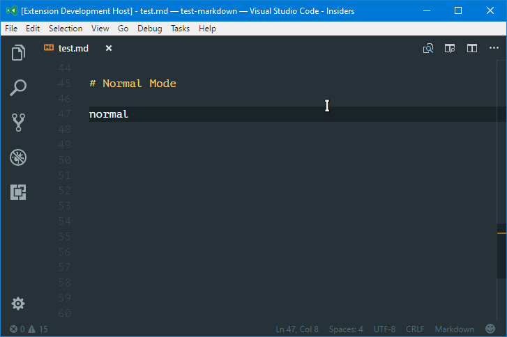
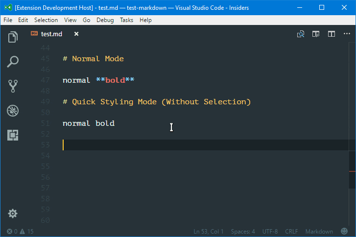
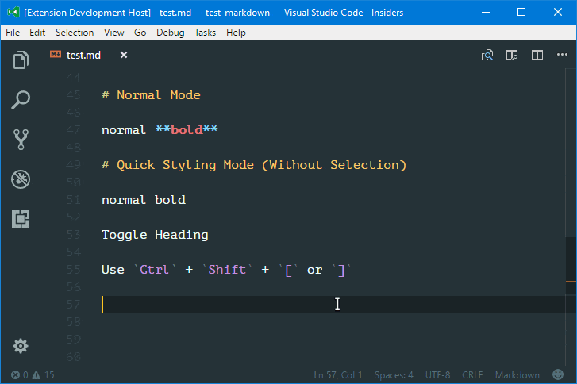
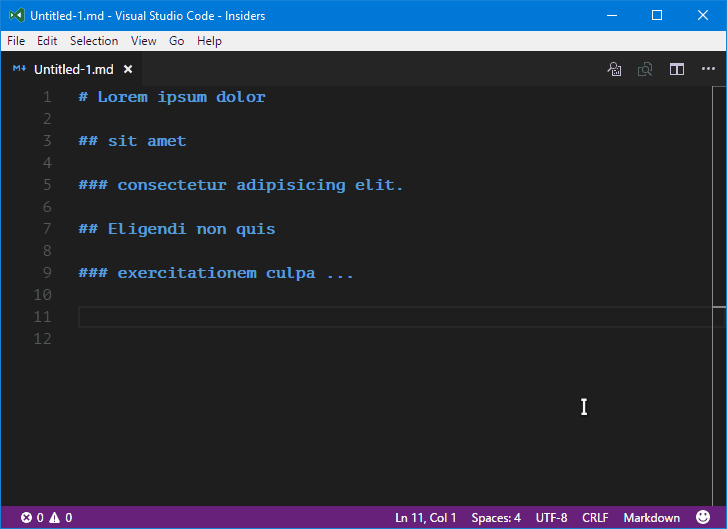
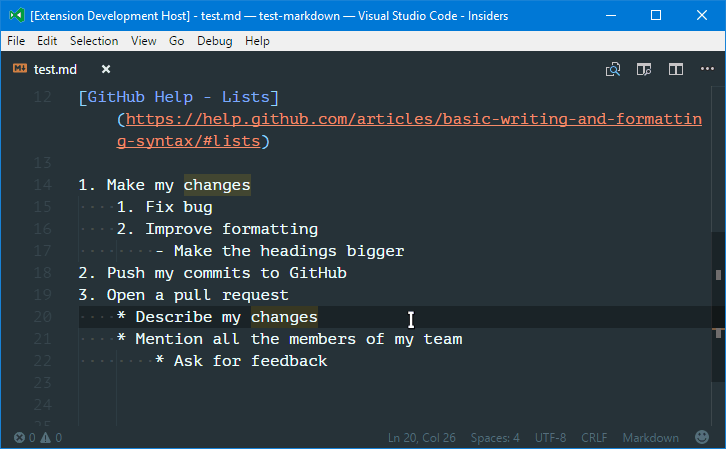
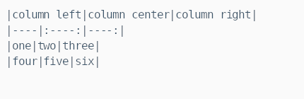
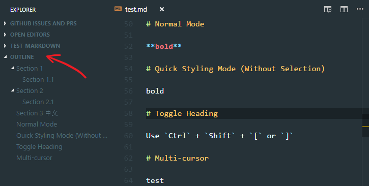
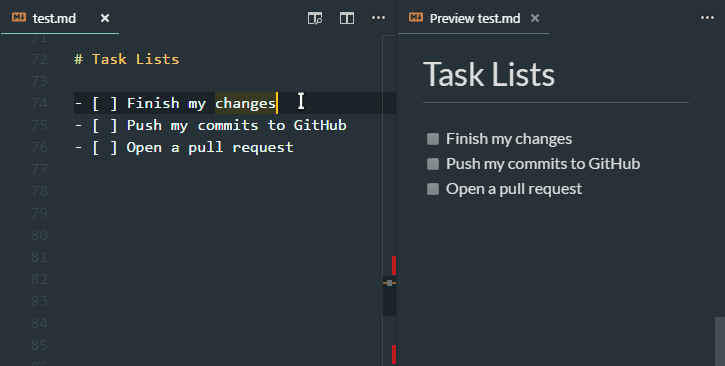
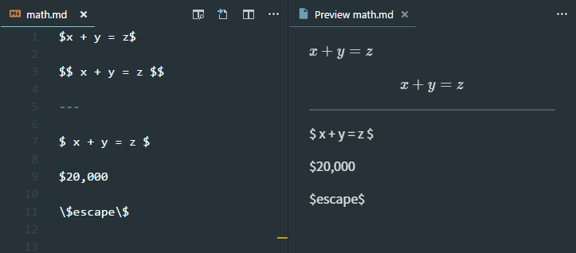

# Markdown Support for Visual Studio Code

  
  
  

All you need for Markdown (keyboard shortcuts, table of contents, auto preview and more).

## Features

- **Keyboard shortcuts** (toggle bold, italic, code span, strikethrough and heading)
  - Tip: in normal mode, `**word|**` -> `**word**|` (<kbd>Ctrl</kbd> + <kbd>B</kbd>)
  - *Quick styling mode*: toggle bold/italic without selecting words
- **Table of contents** (No additional annoying tags like `<!-- TOC -->`)
  - To make TOC compatible with GitHub, you might need to set options `encodeUri` and `toLowerCase` to `false`
- **Outline view** in explorer panel
- **Automatically show preview** when opening a Markdown file (Disabled by default)
- **Print Markdown to HTML**
  - It's recommended to print the exported HTML to PDF with browser (e.g. Chrome) if you want to share your documents with others
- **List editing** (continue list when pressing <kbd>Enter</kbd> at the end of a list item) (also work for quote block)
  - Pressing <kbd>Tab</kbd> at the beginning of a list item will indent it
  - Pressing <kbd>Backspace</kbd> at the beginning of a list item will unindent it (or delete the list marker)
  - Blank list item will be remove on <kbd>Enter</kbd>
- **GitHub Flavored Markdown**
  - Table formatter (<kbd>Alt</kbd> + <kbd>Shift</kbd> + <kbd>F</kbd>)
  - Task list (use <kbd>Alt</kbd> + <kbd>C</kbd> to check/uncheck a list item)
- **Math rendering**
- **Word completion** (moved to a standalone extension [Dictionary Completion](https://marketplace.visualstudio.com/items?itemName=yzhang.dictionary-completion))
- **Others**
  - Override "Open Preview" keybinding with "Toggle Preview", which means you can close preview using the same keybinding (<kbd>Ctrl</kbd> + <kbd>Shift</kbd> + <kbd>V</kbd> or <kbd>Ctrl</kbd> + <kbd>K</kbd> <kbd>V</kbd>).

### Keyboard Shortcuts

<!--  -->

### Table of Contents

### List Editing

### Table Formatter

### Outline

### Task Lists

### Math Rendering

## Shortcuts

| Key                                               | Command                      |
| ------------------------------------------------- | ---------------------------- |
| <kbd>Ctrl</kbd> + <kbd>B</kbd>                    | Toggle bold                  |
| <kbd>Ctrl</kbd> + <kbd>I</kbd>                    | Toggle italic                |
| <kbd>Alt</kbd> + <kbd>S</kbd>                     | Toggle strikethrough         |
| <kbd>Ctrl</kbd> + <kbd>Shift</kbd> + <kbd>]</kbd> | Toggle heading (uplevel)     |
| <kbd>Ctrl</kbd> + <kbd>Shift</kbd> + <kbd>[</kbd> | Toggle heading (downlevel)   |
| <kbd>Alt</kbd> + <kbd>C</kbd>                     | Check/Uncheck task list item |

## Available Commands

- Markdown: Create Table of Contents
- Markdown: Update Table of Contents
- Markdown: Toggle code span
- Markdown: Print current document to HTML

## Supported Settings

| Name                                               | Default   | Description                                                       |
| -------------------------------------------------- | --------- | ----------------------------------------------------------------- |
| `markdown.extension.toc.levels`                    | `1..6`    | Control the heading levels to show in the table of contents.      |
| `markdown.extension.toc.unorderedList.marker`      | `-`       | Use `-`, `*` or `+` in the table of contents (for unordered list) |
| `markdown.extension.toc.orderedList`               | `false`   | Use ordered list in the table of contents.                        |
| `markdown.extension.toc.plaintext`                 | `false`   | Just plain text.                                                  |
| `markdown.extension.toc.updateOnSave`              | `true`    | Automatically update the table of contents on save.               |
| `markdown.extension.toc.githubCompatibility`       | `false`   | GitHub compatibility                                              |
| `markdown.extension.preview.autoShowPreviewToSide` | `false`   | Automatically show preview when opening a Markdown file.          |
| `markdown.extension.orderedList.marker`            | `ordered` | Or `one`: always use `1.` as ordered list marker                  |
| `markdown.extension.italic.indicator`              | `*`       | Use `*` or `_` to wrap italic text                                |
| `markdown.extension.quickStyling`                  | `false`   | Toggle bold/italic without selecting words                        |
| `markdown.extension.showExplorer`                  | `true`    | Show outline view in explorer panel                               |
| `markdown.extension.print.absoluteImgPath`         | `true`    | Convert image path to absolute path                               |

## Changelog

See [CHANGELOG](CHANGELOG.md) for more information.

## Contributing

Bugs, feature requests and more, in [GitHub Issues](https://github.com/neilsustc/vscode-markdown/issues).

Or leave a review on [vscode marketplace](https://marketplace.visualstudio.com/items?itemName=yzhang.markdown-all-in-one#review-details) 😉.
