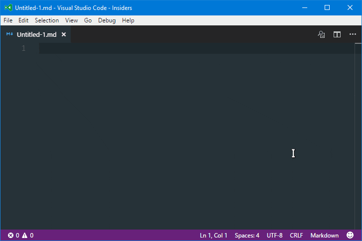

# Markdown Support for Visual Studio Code

All you need for Markdown (keyboard shortcuts, table of contents, auto preview and more).

## Features

- Keyboard shortcuts (toggle bold, italic, heading)
  - Different behaviors depending on the context (see introduction below)
- Table of contents (**No additional annoying tags like `<!-- TOC -->`**)
- Automatically show preview when openning a Markdown file (Disabled by default)
  - ~~Automatically close preview when changing editor~~
- ~~Print your Markdown to PDF~~ (not satisfied with the current solution)
- Continue list item (when pressing <kbd>Enter</kbd> at the end of a list item) (also work for quote block)
  - Blank list item won't be continued
  - (Planed: Pressing <kbd>Tab</kbd> on the blank list item will indent it)
- Word completion

Note: After version 1.10.0, the language specific default setting for Markdown disables quick suggestions. To enable this, put
```
"[markdown]": {
    "editor.quickSuggestions": true
}
```
into your `settings.json`.

### Keyboard Shortcuts

- When toggling bold or italic,
  - If there is NO selection, pressing the hotkey will **turn on** or **off** the style
    - `|` becomes `**|**` or `*|*` (turn on the style)
    - `**|**` or `*|*` becomes `|` (turn off the style)
    - `**bold|**` or `*italic|*` becomes `**bold**|` or `*italic*|` (turn off the style, if the cursor is at the end of a **bold** or *italic* block)
  - If there is a selection, pressing the hotkey will add or remove asterisk (`*`) depending on the selected text
- When toggling heading,
  - the same logic with indenting/unindenting one line (<kbd>ctrl</kbd> + <kbd>]</kbd>/<kbd>[</kbd>)
  - easily adjusting the heading level without moving cursor to the beginning of the line (<kbd>ctrl</kbd> + <kbd>shift</kbd> + <kbd>]</kbd>/<kbd>[</kbd>)


### Table of Contents


### Word Completion



<!-- ### Print to PDF

 -->

## Shortcuts

| Key | Command |
| --- | --- |
| <kbd>ctrl</kbd> + <kbd>b</kbd> | Toggle bold |
| <kbd>ctrl</kbd> + <kbd>i</kbd> | Toggle italic |
| <kbd>ctrl</kbd> + <kbd>shift</kbd> + <kbd>]</kbd> | Toggle heading (uplevel) |
| <kbd>ctrl</kbd> + <kbd>shift</kbd> + <kbd>[</kbd> | Toggle heading (downlevel) |

## Available Commands

- Markdown: Toggle Bold
- Markdown: Toggle Italic
- Markdown: Toggle Heading Uplevel
- Markdown: Toggle Heading Downlevel
- Markdown: Create Table of Contents
- Markdown: Update Table of Contents
- Markdown: Print to PDF

## Supported Settings

| Name | Default | Description |
| --- | --- | --- |
| `markdown.extension.toc.depth` | `6` | Control the heading level to show in the table of contents. |
| `markdown.extension.toc.orderedList` | `false` | Use ordered list in the table of contents. |
| `markdown.extension.toc.plaintext` | `false` | Just plain text. |
| `markdown.extension.toc.updateOnSave` | `false` | Automatically update the table of contents on save. |
| `markdown.extension.preview.autoShowPreviewToSide` | `false` | Automatically show preview when openning a Markdown file. |
| `markdown.extension.completion.enabled` | `true` | Show word suggestions or not. |

## Changelog

### Latest 0.5.1 (2017.04.16)

- NEW: Automatically close Markdown preview when changing editor

### 0.5.0 (2017.04.13)

- NEW: New shortcut behavior to let cursor jump out of **bold** or *italic* block

Thanks, [Zach Kirkland (@zkirkland)](https://github.com/zkirkland)

See [CHANGELOG](CHANGELOG.md) for more information.

## Roadmap

These depend on the feedback and user requests.

## Contributing

Bugs, feature requests and more, in [GitHub Issues](https://github.com/neilsustc/vscode-markdown/issues).

## Known Issues

- To avoid distractive HTML comments, this extension will 'guess' where the TOC is. Currently, a TOC will be recognized if
  - It's a list block in Markdown syntax
  - Its first list item title matches the first heading in the file
- CJK in TOC anchors (A more complex slugify function is needed)
- (**Help wanted**) Because of the using of `html-pdf` package,
  - Anchors within PDF won't work
  - No bookmarks generated

## Acknowledgement

Inspired by and part of codes from,

- [mdickin/vscode-markdown-shortcuts](https://github.com/mdickin/vscode-markdown-shortcuts)
- [AlanWalk/Markdown-TOC](https://github.com/AlanWalk/Markdown-TOC)
- [hnw/vscode-auto-open-markdown-preview](https://github.com/hnw/vscode-auto-open-markdown-preview)
- [yzane/vscode-markdown-pdf](https://github.com/yzane/vscode-markdown-pdf)

## Useful Links

- [CommonMark](http://commonmark.org/): A strongly defined, highly compatible specification of Markdown
