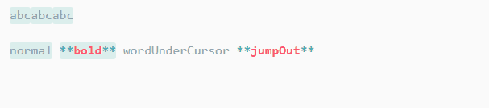
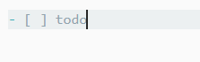
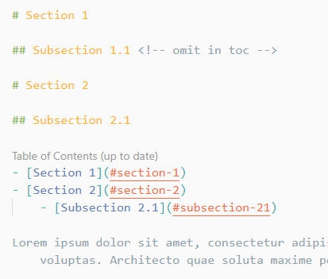
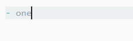
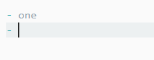
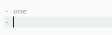
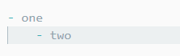
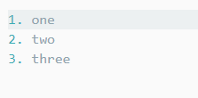
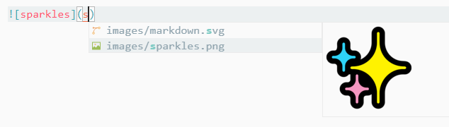
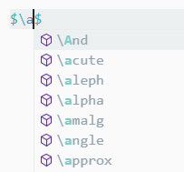

# Markdown Support for Visual Studio Code

All you need for Markdown (keyboard shortcuts, table of contents, auto preview and more).

## Features

- **Keyboard shortcuts** (toggle bold, italic, code span, strikethrough and heading)

   (toggle bold)

   (check/uncheck task list)

  See full key binding list in [keyboard shortcuts](#keyboard-shortcuts) section

- **Table of contents**

  

  - The indentation rules (tab or spaces) of TOC will be the same of your current file (find it in the right bottom corner)

  - To make TOC compatible with GitHub, you need to set option `githubCompatibility` to `true`

  - Use `<!-- omit in toc -->` to ignore specific heading in TOC

- **List editing**

   (<kbd>Enter</kbd>)

   (<kbd>Enter</kbd>)

   (<kbd>Tab</kbd>)

   (<kbd>Backspace</kbd>)

   (auto fix ordered list markers)

- **Print Markdown to HTML**

  - Command `Markdown: Print current document to HTML`

  - It's recommended to print the exported HTML to PDF with browser (e.g. Chrome) if you want to share your documents with others

- **GitHub Flavoured Markdown**

  - Table formatter

    

    (Note that the keybinding is <kbd>Ctrl</kbd> + <kbd>Shift</kbd> + <kbd>I</kbd> on Linux)

  - Task list

- **Math**

  

- **Auto completions**

  - Images

    

  - Math functions

    

  - Reference links

    

- **Others**

  - Paste link on selected text

    

  - Override "Open Preview" keybinding with "Toggle Preview", which means you can close preview using the same keybinding (<kbd>Ctrl</kbd> + <kbd>Shift</kbd> + <kbd>V</kbd> or <kbd>Ctrl</kbd> + <kbd>K</kbd> <kbd>V</kbd>).

## Available Commands

- Markdown: Create Table of Contents
- Markdown: Update Table of Contents
- Markdown: Toggle code span
- Markdown: Print current document to HTML
- Markdown: Toggle math environment
- Markdown: Toggle list

## Keyboard Shortcuts

Table

| Key                                               | Command                      |
| ------------------------------------------------- | ---------------------------- |
| <kbd>Ctrl</kbd> + <kbd>B</kbd>                    | Toggle bold                  |
| <kbd>Ctrl</kbd> + <kbd>I</kbd>                    | Toggle italic                |
| <kbd>Ctrl</kbd> + <kbd>Shift</kbd> + <kbd>]</kbd> | Toggle heading (uplevel)     |
| <kbd>Ctrl</kbd> + <kbd>Shift</kbd> + <kbd>[</kbd> | Toggle heading (downlevel)   |
| <kbd>Ctrl</kbd> + <kbd>M</kbd>                    | Toggle math environment      |
| <kbd>Alt</kbd> + <kbd>C</kbd>                     | Check/Uncheck task list item |
| <kbd>Ctrl</kbd> + <kbd>Shift</kbd> + <kbd>V</kbd> | Toggle preview               |
| <kbd>Ctrl</kbd> + <kbd>K</kbd> <kbd>V</kbd>       | Toggle preview to side       |

## Supported Settings

Table

| Name                                               | Default    | Description                                                       |
| -------------------------------------------------- | ---------- | ----------------------------------------------------------------- |
| `markdown.extension.italic.indicator`              | `*`        | Use `*` or `_` to wrap italic text                                |
| `markdown.extension.list.indentationSize`          | `adaptive` | Use different indentation size for ordered and unordered list     |
| `markdown.extension.orderedList.autoRenumber`      | `true`     | Auto fix list markers as you edits                                |
| `markdown.extension.orderedList.marker`            | `ordered`  | Or `one`: always use `1.` as ordered list marker                  |
| `markdown.extension.preview.autoShowPreviewToSide` | `false`    | Automatically show preview when opening a Markdown file.          |
| `markdown.extension.print.absoluteImgPath`         | `true`     | Convert image path to absolute path                               |
| `markdown.extension.print.imgToBase64`             | `false`    | Convert images to base64 when printing to HTML                    |
| `markdown.extension.print.onFileSave`              | `false`    | Print to HTML on file save                                        |
| `markdown.extension.showExplorer`                  | `true`     | Show outline view in explorer panel                               |
| `markdown.extension.syntax.decorations`            | `true`     | Add decorations to strikethrough and code spans                   |
| `markdown.extension.syntax.plainTheme`             | `false`    | A distraction-free theme                                          |
| `markdown.extension.toc.githubCompatibility`       | `false`    | GitHub compatibility                                              |
| `markdown.extension.toc.downcaseLink`              | `true`     | Force the TOC links to be lowercase                               |
| `markdown.extension.toc.levels`                    | `1..6`     | Control the heading levels to show in the table of contents.      |
| `markdown.extension.toc.orderedList`               | `false`    | Use ordered list in the table of contents.                        |
| `markdown.extension.toc.plaintext`                 | `false`    | Just plain text.                                                  |
| `markdown.extension.toc.tabSize`                   | `auto`     | Control the indentation size of TOC (`auto` or a number)          |
| `markdown.extension.toc.unorderedList.marker`      | `-`        | Use `-`, `*` or `+` in the table of contents (for unordered list) |
| `markdown.extension.toc.updateOnSave`              | `true`     | Automatically update the table of contents on save.               |
| `markdown.extension.katex.macros`                  | `{}`       | KaTeX macros e.g. `{ "\\name": "expansion", ... }`                |

## Changelog

See [CHANGELOG](CHANGELOG.md) for more information.

## Latest Development Build

Download it [here](https://ci.appveyor.com/project/yzhang-gh/vscode-markdown/build/artifacts).

To install, execute `Extensions: Install from VSIX...` in the Command Palette (`ctrl + shift + p`)

## Contributing

- File bugs, feature requests in [GitHub Issues](https://github.com/yzhang-gh/vscode-markdown/issues).
- Leave a review on [Visual Studio Marketplace](https://marketplace.visualstudio.com/items?itemName=yzhang.markdown-all-in-one#review-details).
- Buy me a coffee ☕ (via [PayPal](https://www.paypal.me/2yzhang), [Alipay or WeChat](donate.md)).

Special thanks to all the [contributors](https://github.com/yzhang-gh/vscode-markdown/graphs/contributors).

---

Thanks [VSCode Power User Course](https://VSCode.pro?utm_source=MarkdownAllInOne) for sharing many VSCode tips with me.

